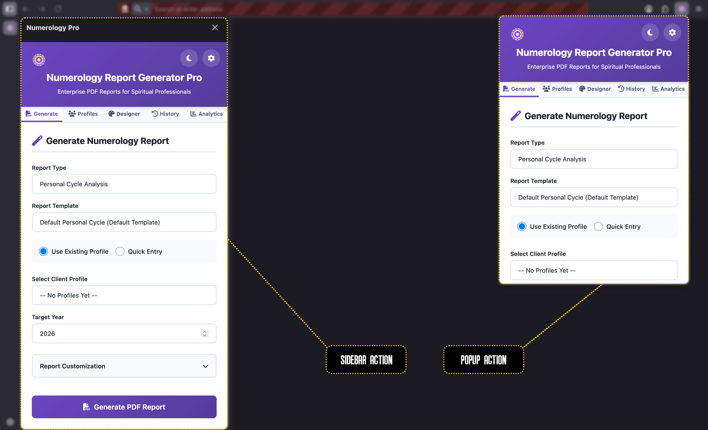

<div align="center">



</div>


# Numerology Report Generator Pro

[](https://opensource.org/licenses/MIT)
[](https://github.com/dakidarts/numerology-report-generator-pro)
[](https://github.com/dakidarts/numerology-report-generator-pro/releases)
[](https://github.com/dakidarts/numerology-report-generator-pro/pulls)

> Enterprise-grade PDF report generator for numerology professionals. Create beautiful, customizable numerology reports with multi-language support.

<p align="center">
  
</p>

## ✨ Features

### 🎨 **Professional Report Designer**
- 17+ font family options for titles and body text
- Customizable color schemes (primary, secondary, accent, background)
- Template system with save/edit/delete functionality
- Custom practitioner branding in footers

### 📊 **Report Generation**
- Personal Cycle Analysis reports
- Client profile management system
- Quick entry mode for one-time reports
- Auto-save functionality
- Report history tracking

### 🌍 **Multi-Language Support**
- **8 Languages**: English, French, Spanish, German, Russian, Hindi, Bengali, Portuguese
- Complete UI translation
- Easy language switching in settings

### 💼 **Client Management**
- Comprehensive profile fields (name, DOB, birth place, city, country, timezone)
- Search and filter profiles
- Import/export capabilities
- Notes and contact information storage

### 📈 **Analytics Dashboard**
- Total reports generated
- Monthly statistics
- Popular report types
- 30-day trend charts

### 🎯 **Enterprise Features**
- Offline-capable Firefox extension
- Local data storage (localStorage)
- No external dependencies for data
- Professional PDF output with jsPDF
- Chart.js integration for analytics

## 🚀 Installation

### Firefox Extension

1. Clone the repository:
```bash
git clone https://github.com/dakidarts/numerology-report-generator-pro.git
cd numerology-report-generator-pro
```

2. Open Firefox and navigate to `about:debugging#/runtime/this-firefox`

3. Click "Load Temporary Add-on"

4. Navigate to the `dev` folder and select `manifest.json`

5. The extension icon will appear in your toolbar

## 🔑 API Configuration

This extension uses [The Numerology API](https://rapidapi.com/dakidarts-dakidarts-default/api/the-numerology-api) from RapidAPI.

1. Get your free API key from [RapidAPI](https://rapidapi.com/dakidarts-dakidarts-default/api/the-numerology-api)
2. Open the extension and click the settings icon
3. Enter your API key in the "API Configuration" section
4. Click "Save API Key"

## 📖 Usage

### Generate a Report

1. **Select Report Type**: Choose "Personal Cycle Analysis"
2. **Choose Template**: Select from default or custom templates
3. **Client Selection**:
   - Use existing profile from your saved clients
   - Or use Quick Entry for one-time reports
4. **Set Target Year**: Enter the year for analysis
5. **Customize** (Optional): Add custom report title
6. **Generate**: Click "Generate PDF Report"

### Create Custom Templates

1. Navigate to the **Designer** tab
2. Click "Create New Template"
3. Configure:
   - Template name
   - Font families (title and body)
   - Font sizes (12-36pt)
   - Color scheme (primary, secondary, accent, background)
4. Save your template
5. Use it for future reports

### Manage Client Profiles

1. Go to the **Profiles** tab
2. Click "Add New Profile"
3. Fill in client details:
   - Personal information (name, DOB, birth place)
   - Contact details (email, phone)
   - Location (city, country, timezone)
   - Notes
4. Save and reuse for quick report generation


## 🛠️ Technologies

- **Frontend**: HTML5, CSS3, Vanilla JavaScript
- **PDF Generation**: jsPDF
- **Charts**: Chart.js
- **Storage**: localStorage API
- **Platform**: Firefox WebExtension API
- **i18n**: Custom translation system

## 🌟 Key Features Breakdown

### Template System
- Default templates (non-deletable, editable)
- User-created templates (full CRUD operations)
- Per-report-type template organization
- Font customization (17 families)
- Color scheme customization

### Report Customization
- Custom report titles
- Practitioner branding
- Dynamic footer with website link
- Automatic text color contrast
- Lightened primary color accents

### Data Management
- All data stored locally
- No cloud dependencies
- Export/import capabilities
- Search and filter functionality
- Automatic data persistence

## 🤝 Contributing

Contributions are welcome! Please feel free to submit a Pull Request.

1. Fork the repository
2. Create your feature branch (`git checkout -b feature/AmazingFeature`)
3. Commit your changes (`git commit -m 'Add some AmazingFeature'`)
4. Push to the branch (`git push origin feature/AmazingFeature`)
5. Open a Pull Request

## 📝 License

This project is licensed under the MIT License - see the [LICENSE](LICENSE) file for details.

## 🔗 Links

- **API Documentation**: [The Numerology API](https://rapidapi.com/dakidarts-dakidarts-default/api/the-numerology-api)
- **Website**: [NumerologyAPI.com](https://numerologyapi.com)
- **YouTube**: [@dakidarts](https://youtube.com/@dakidarts)
- **Twitter/X**: [@dakidarts](https://x.com/dakidarts)
- **Instagram**: [@dakidarts](https://instagram.com/dakidarts)
- **GitHub**: [@dakidarts](https://github.com/dakidarts)

## ☕ Support

If you find this project helpful, consider buying me a coffee!

[](https://www.buymeacoffee.com/dakidarts)

## 📧 Contact

For questions, suggestions, or support:
- **Email**: Contact via [NumerologyAPI.com](https://numerologyapi.com/about/)
- **Issues**: [GitHub Issues](https://github.com/dakidarts/numerology-report-generator-pro/issues)


## 📊 Version History

### v1.0.1 (Current)
- ✅ Multi-language support (8 languages)
- ✅ Complete UI translation system
- ✅ Template designer system

### v1.0.0
- ✅ Initial release
- ✅ Personal Cycle Analysis reports
- ✅ Client profile management
- ✅ Analytics dashboard
- ✅ Custom branding support

---

<p align="center">
  Made with ❤️ by <a href="https://github.com/dakidarts">Dakidarts</a>
</p>

<p align="center">
  © Dakidarts® - All Rights Reserved
</p>
